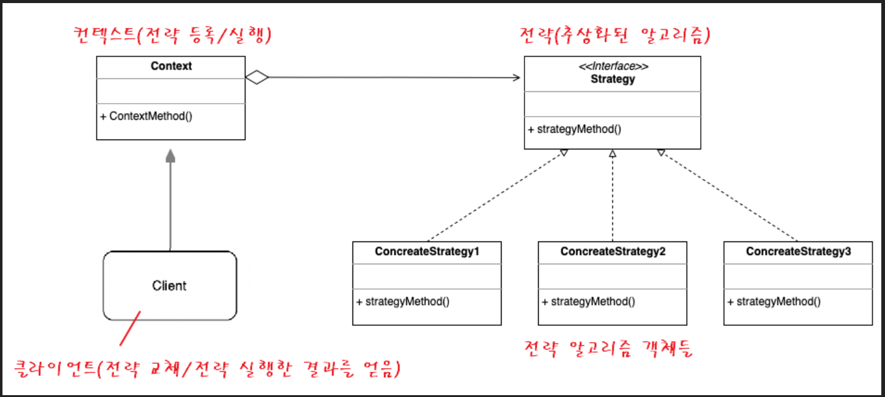
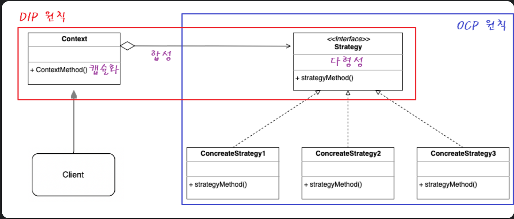
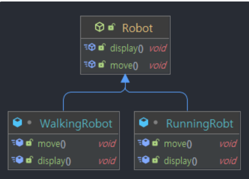
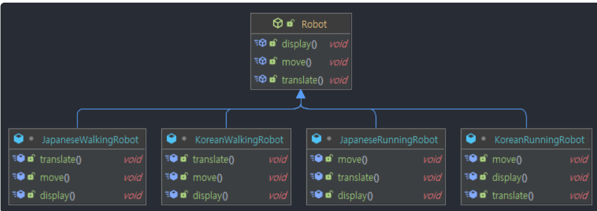
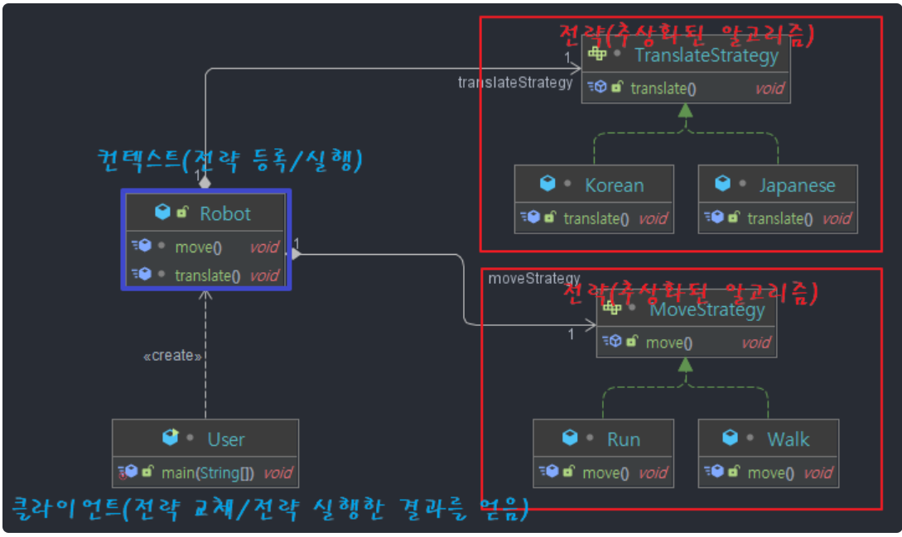
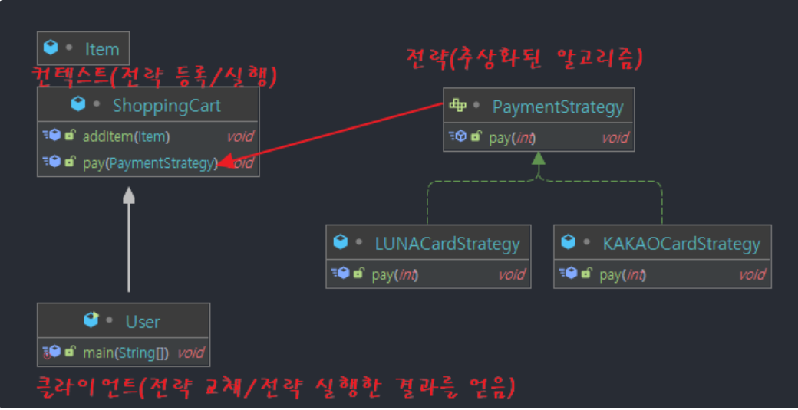

# Strategy Pattern
## 참고 위치
> https://inpa.tistory.com/entry/GOF-%F0%9F%92%A0-%EC%A0%84%EB%9E%B5Strategy-%ED%8C%A8%ED%84%B4-%EC%A0%9C%EB%8C%80%EB%A1%9C-%EB%B0%B0%EC%9B%8C%EB%B3%B4%EC%9E%90#comparator
> 
> https://brightstarit.tistory.com/39
> 
## 전략패턴의 구성도

> 
>
>

## 예제로 구성된 전략 패턴 
> ## 1) robot_sample  
> ### 1-1) 원래의 구조  
>   
> ### 여기에 translate라는 기능 추가를 요청 받았을 경우
> 클래스가 기하급수적으로 늘어나게 된다.
> 
> 
> 
> ### 1-2) 전략패턴 적용
> 
> 

> ## 2) card_sample
> 