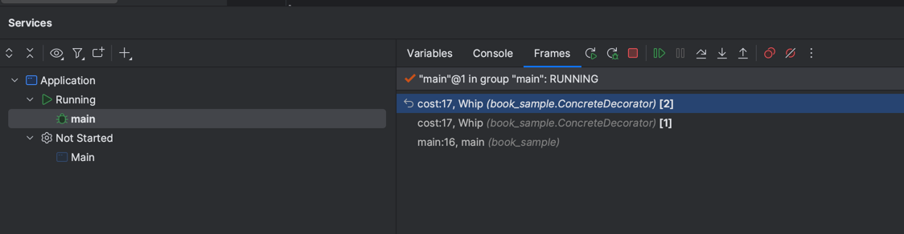

## Decorator Pattern

#### Decorator Pattern이란?
서브클래싱 대신 Decorator를 동적으로 변경하면서 유연하게 대처

<br>

#### Java package 예시 (https://ckddn9496.tistory.com/9)
```java
InputStream in = new BufferedInputStream(new FileInputStream("test.txt"));
```
1. InputStream (Component): 기본 바이트 입력 스트림을 나타내는 추상 클래스 
2. FileInputStream (ConcreteComponent): 파일에서 바이트를 읽는 구체적인 입력 스트림
3. FilterInputStream (Decorator): 다른 입력 스트림을 감싸서 추가 기능을 제공하는 추상 클래스
4. BufferedInputStream (ConcreteDecorator): 입력 스트림에 버퍼링 기능을 추가하여 성능을 향상
5. DataInputStream (ConcreteDecorator): 기본 데이터 타입을 읽을 수 있는 기능을 추가

<br>

#### 헤드퍼스트 디자인패턴 3장 Decorator Pattern 예시 수행결과


    기본커피 [에스프레소] 가격 : 1.99
    휘핑 올라간 커피 [에스프레소, 휘핑] 가격 : 2.09
    휘핑 올라간 커피 [에스프레소, 휘핑, 휘핑] 가격 : 2.19
