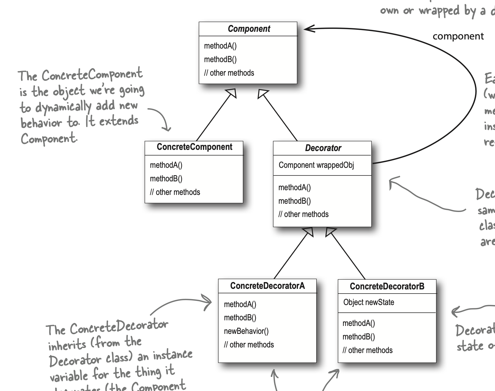

## decoartor pattern
- decorator pattern에서는 subclass 중 하나가 추상 클래스이다. decorator들은 이 추상 클래스(추상 데코레이터)를 상속하며, interface의 메써드를 구현하고 있다. 
- decorator들이 구현한 메써드 안에서는 subclass의 동일한 메써드를 내부에서 호출하며 전과 후에 decorator가 원하는 연산을 추가할 수 있다.
- decorator의 타입은 subclass와 같아야 한다.
- open-closed principle에 해당하는 패턴으로 볼 수 있다.
- 합성과 위임이 사용된다 (composition and delegation)

## 특징
- wrapper이다. wrapper안에서 decorating 하길 원하는 클래스의 같은 메써드에 역할을을 위임한다. 그리고 그 안에 있는 클래스는 또 다시 위임할 수 있고 반복할 수 있다. 
- decorator는 wrap을 할 클래스에 대한 호출을 해야하기 때문에 wrapperObj를 선언한다. 
- 

### 단점
- 모든 작은 작업들을 decorator로 만들기 시작하면 클래스가 너무 번잡해질 수 있다. decorator는 runtime에 원하는 기능을 추가할 수 있는 간편한 도구 이기 때문이다.
- client는 어떤 decorator들이 존재하는지, 추가되어 있는지 알 수가 없다. 
